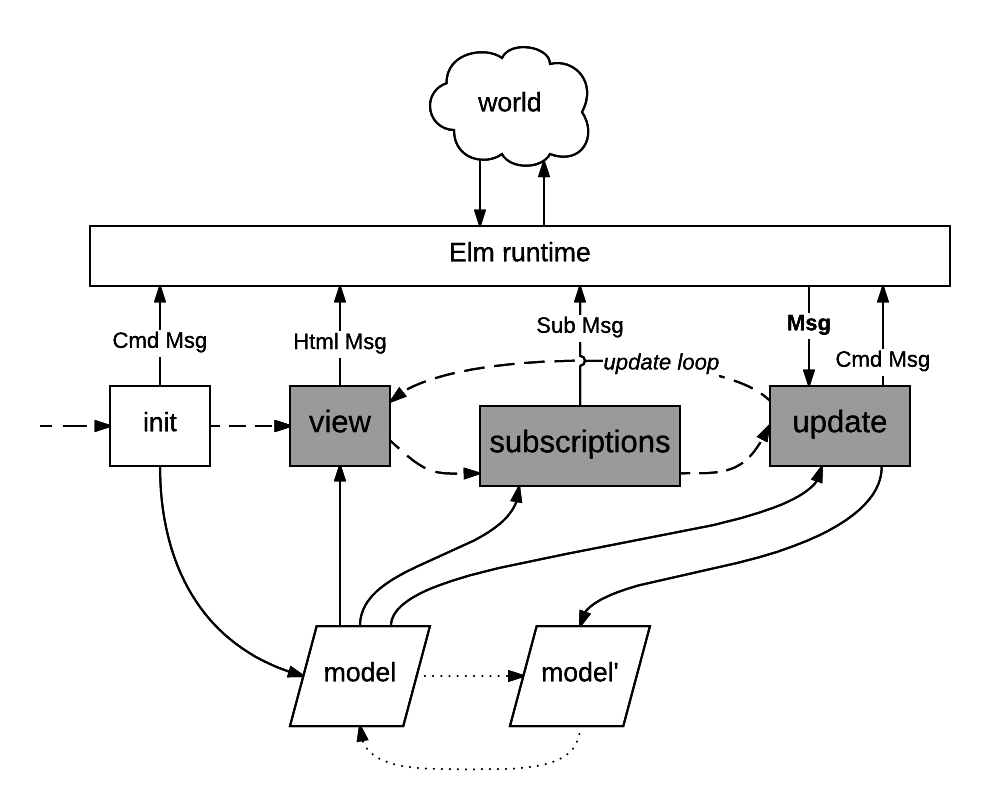

Here is a simplified model of how an Elm 0.17 program operates.

The `update` function blocks waiting for the next incoming `Msg`. When received it creates a new model value and commands. The `view` and `subscriptions` functions then run against the new model value, producing new `Html Msg` and `Sub Msg` values, respectively. Then `update` waits for the next Msg.
Note that `subscriptions` is called after each `update`.


<!-- https://www.lucidchart.com/documents/edit/e84d384b-ff47-4549-bb18-df124af6bbae -->



## Update loop as Elm pseudo-code

```haskell
program init update view subscriptions =
    let
        ( model, cmds ) =
            init
    in
        loop update view subscriptions model cmds


loop update view subscriptions model cmds =
    let
        _ =
            cmds |> runtime.runCmds

        _ =
            view model |> runtime.displayHtml
			
        _ =
            subscriptions model |> runtime.registerSubs

        msg =
            runtime.waitForMsg

        ( model', cmds' ) =
            update msg model
    in
        loop update view subscriptions model' cmds'


{- The assumed `runtime` module executes the operations above,
all having side-effects. -}
```
